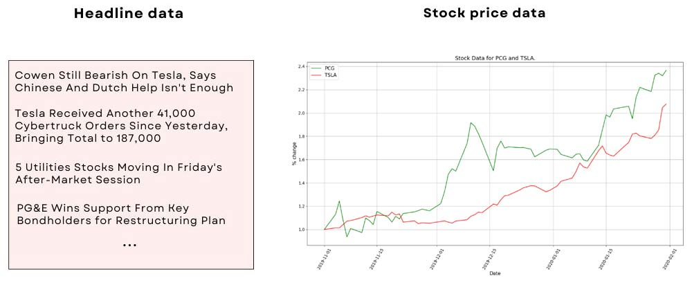
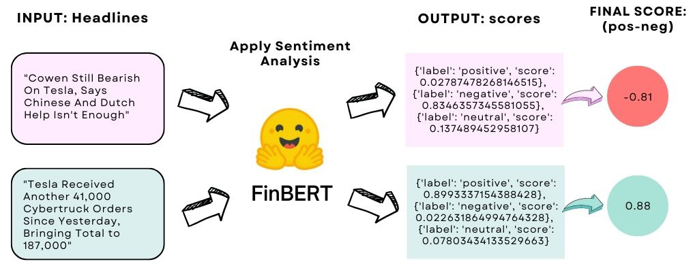
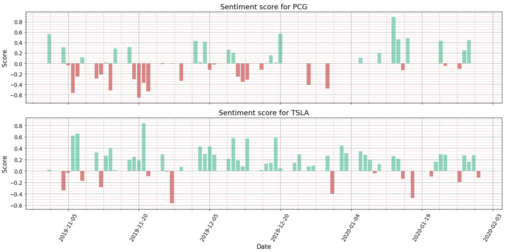

# Comparing the Sentiments of Financial News Headlines to Stock Prices. 
### A Deep Learning Sentiment Analysis on News Headlines using <i>FinBERT</i>

 
It seems plausible that financial news headlines can affect stock prices given that investors are often influenced by what they read in the news and investors then affect prices. Accordingly, sentiment is often used in forecasting stocks as one indicator (among others). This project attempts to discover if any connection exists at all between news and stock price. The purpose here is not to try to forecast or predict anything – that requires many other factors – but just to detect any kind of correlation.

There are many NLP models for sentiment analysis available, such as Vader and TextBlob. However, this project utilises FinBERT, a deep learning language model based on Google’s BERT that was fine-tuned on financial text. (See the original research paper [here](https://arxiv.org/pdf/1908.10063v1.pdf)). 

The steps covered in the [Jupyter Notebook](https://github.com/quarterpastten/EDA-on-sentiment-analysis-and-stock-prices/blob/main/EDA_sentiment.ipynb) are as follows: 

 

 

1.	Retrieve financial news headlines and specify a small selection of stocks over a short period of time. 
2.	Retrieve the stock prices for these tickers for the given time.
3.	Preprocess the news data to ensure the publish data matches the business days of the stock exchange for the tickers
4.	Do the sentiment analysis on the headlines using FinBERT
5.	Perform statistical analysis to test for correlation between sentiment and price over time

### Data retrieval and preprocessing 

The headline data was obtained from a large [Kaggle](https://www.kaggle.com/miguelaenlle/massive-stock-news-analysis-db-for-nlpbacktests?select=analyst_ratings_processed.csv) dataset of 6000+ stocks, whilst the stock price data was retrieved using Pandas Datareader, which allows us to create a dataframe based on Yahoo Finance data. We then choose two tickers which have a sufficient number of headlines over the same short period – TLSA (Tesla) and PCG (Pacific and Electric Company) – to work with. 

 

 

### Preprocessing

Stock markets operate between certain times and so we need to ensure that a headline that is published after close on a particular day is assigned to the next business day since obviously such a headline can have no effect on trading on the day it is published. To offset days, we use the BusinessDay (Bday) subclass from Pandas. 

 

### Sentiment analysis with FinBERT

The sentiment analysis is done using FinBERT, and implemented using the pipeline module that is included in the HuggingFace Transformers library. As seen below, raw headline data is inputted, and FinBERT returns three scores per headline: a positive, negative and a neutral score, each representing a probability between 0 and 1, and all summing to 1. To get a single score the negative value is simply subtracted from the positive value. 

 

 
 

The distribution of negative to positive headlines over time can then be obtained: 

 
 

    

### Statistical analysis and tests for correlation

Finally, we want to see if there is any correlation between sentiment and stock price over this time period. A number of preparatory steps are made to avoid ‘spurious’ correlations (i.e. mistakenly seeing correlations in time series that do not exist), including ensuring the time-series are stationary, i.e. have consistent mean and variance, and any trend or seasonality is removed. (This is all done using the statsmodels library). Finally, we may plot the cross-correlations between stock price and sentiment for each ticker: 

 

### Conclusions 

The blue lines are the confidence interval. Where the stems protrude outside of the confidence interval, the correlation is held to be significant. Here the plot suggests some negative correlation for PCG for this time period, though mainly at a significant lag. We find none for TSLA. So this is a mixed result. Further analysis would be required to form any firmer conclusions, including whether this pattern holds for these tickers at different time periods or different window sizes in time, or whether different tickers have any correlation. 

